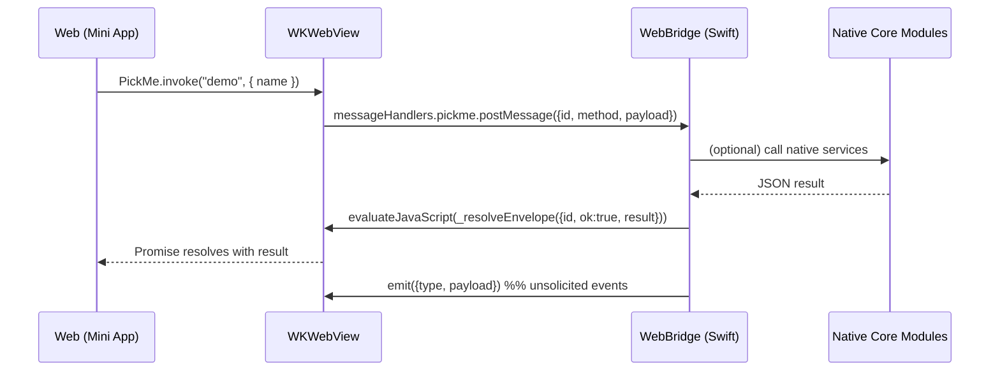
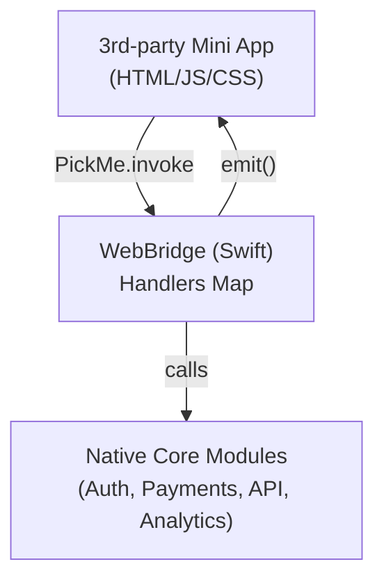

# PickMe Web Bridge — Mini App Demo

> A tiny, production-ish bridge that lets **third-party web mini-apps** talk to our **native core modules** through a clean, JSON-only API. One function contract. Two-way communication. Easy to hand off.

---

## What is this?

A **mini app** is a web experience (HTML/JS/CSS) embedded in our iOS app via `WKWebView`.  
This demo ships a minimal **WebBridge** that exposes a **small set of native handlers** (functions) to the web page:

- Web calls: `PickMe.invoke("methodName", { ...payload })`
- Native handles the request and replies with JSON
- Web receives a Promise resolution (or rejection)
- Native can also **push events** back to the web page at any time

> Third-party teams only build the **web UI** and call documented handler names. We keep business logic, auth, payments, analytics, etc. in **native core modules**.

---

## Why this approach (for Mini Apps)

- **Fast integration:** hand over a single HTML file + the handler list; third parties ship UI without learning our native stack.
- **Safe contract:** **JSON-only** request/response envelopes; no shared types or binary shims.
- **Two-way comms:** request/response **and** native-to-web **events** (`emit`).
- **Extensible:** add new handlers without breaking the page; keep backward compatibility.
- **Ownership stays native:** core modules (auth, payments, routing, analytics) remain in our app/swift packages.

---

## How it works (at a glance)



**Architecture**  


---

## Core features

- **Single call surface:** `PickMe.invoke(method, payload)`  
  – Everything (bookings, profile, deep links, etc.) funnels through named handlers.
- **Two-way communication:**  
  – **Web → Native:** invoke handlers (returns a Promise)  
  – **Native → Web:** `emit(type, payload)` to push events (e.g., auth state changed, booking updated).
- **Predictable envelopes:**  
  - **Request:** `{ id, method, payload }`  
  - **Success:** `{ id, ok: true, result }`  
  - **Error:** `{ id, ok: false, error: { code, message } }`
- **Handler registry:** `handlers: [String : Handler]` (Swift closures). Add/remove per screen.
- **JSON-only:** serializable dictionaries/arrays/numbers/strings/bools (easy to version, log, and test).
- **Batteries included demo:** `"demo"` method works out-of-the-box for a live round-trip.

---

## Files in this demo

- `WebBridgeView.swift` — SwiftUI `UIViewRepresentable` that sets up `WKWebView`, registers the bridge, and loads your HTML.
- `WebBridge.swift` — The router/bridge. Maps method names → native handlers and resolves replies back to JS.
- `bridge_demo.html` — A minimal page that calls `PickMe.invoke("demo", { name })` and displays the reply.

---

## Quick start

### 1) Present the web mini app
```swift
// SwiftUI view
import SwiftUI

struct MiniAppScreen: View {
  var body: some View {
    WebBridgeView(htmlFileName: "bridge_demo", handlers: [
      // add real handlers here
      "getAppInfo": { _ in .success(["name": "PickMe", "platform": "iOS", "version": "1.0.0"]) }
    ])
  }
}
```

### 2) Call native from the web page
```js
// in bridge_demo.html
const res = await window.PickMe.invoke("demo", { name: "Bishan" });
// -> { message: "Hello, Bishan! (from native)" }
```

### 3) Push events from native (optional)
```swift
// Somewhere in native after a booking is created:
bridge.emit(type: "booking.updated", payload: ["id": "BK-123", "status": "confirmed"])
```

```js
// in the page, receive events
window.PickMe._onEvent = function(evt) {
  if (evt?.type === "booking.updated") {
    // update UI
  }
}
```

---

## Handlers (Native API surface)

A **handler** is a Swift closure that receives a JSON payload and returns `Result<JSON, BridgeError>`:

```swift
public typealias Handler = (_ payload: [String: Any]?) -> Result<[String: Any], BridgeError>
```

Common patterns:

- `getAppInfo` – return app name, version, locale
- `openDeepLink` – navigate inside the native app
- `fetchDoctors` – read from our API cache and return a JSON array
- `createAppointment` – perform booking via native services and return `bookingId`

> Keep handlers quick; WebKit invokes them on the main thread. For heavy work, delegate to your native modules and return lightweight results.

**Error model**

- `UNSUPPORTED_METHOD` — method is not registered
- `INVALID_PAYLOAD` — required fields missing/invalid
- `INTERNAL_ERROR` — unexpected native error

These surface to JS as rejected Promises with `{ code, message }`.

---

## Envelope shapes (copy-paste friendly)

```json
// Request (JS → Native)
{ "id": "req_42", "method": "createAppointment", "payload": { "doctorId": 7, "slot": "2025-09-12T10:30:00Z" } }

// Success (Native → JS)
{ "id": "req_42", "ok": true, "result": { "bookingId": "BK-12345" } }

// Error (Native → JS)
{ "id": "req_42", "ok": false, "error": { "code": "INVALID_PAYLOAD", "message": "doctorId required" } }

// Event (Native → JS, unsolicited)
{ "type": "booking.updated", "payload": { "bookingId": "BK-12345", "status": "confirmed" } }
```

---

## Security & versioning

- **Allow-list only:** only registered handler names are callable.
- **JSON coercion:** non-JSON values are rejected up-front; sanitize/validate payloads in handlers.
- **Channel name:** scoped to `"pickme"`; can be namespaced per vertical if needed.
- **Version handshake (optional):** add a `getBridgeInfo` handler to advertise `{ version, supportedMethods }` so the page can adapt.

---

## Performance notes

- Keep handlers **non-blocking**; delegate to native services and return compact JSON.
- Avoid large payloads; if you must pass images/files, use URLs or base64 chunks.

---

## Hand-off checklist (for third-party teams)

1. **Bridge contract:** share the list of handler names, payload schemas, and result shapes.
2. **Sample page:** provide `bridge_demo.html` as a working reference.
3. **Error codes:** document `code` values they should handle.
4. **Event catalog:** document event `type`s they may receive via `PickMe._onEvent`.

---

## Roadmap (optional)

- Async handler variant (allow `await` inside handlers)
- Method namespaces per vertical (e.g., `events.createBooking`)
- Built-in analytics wrapper on every invoke/resolve

---
